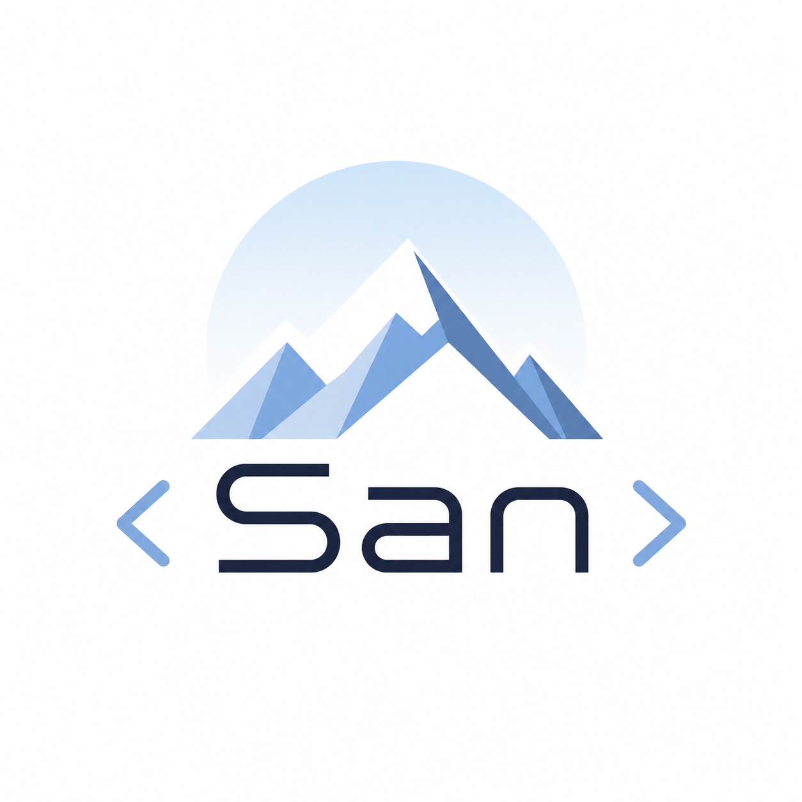

# San Programming Language

<div align="center">
  
</div>

<div align="center">


</div>

---

San is a dynamically and strongly typed, statically-scoped programming language designed with simplicity and clarity in mind. It features a complete lexer, recursive descent parser, and tree-walking interpreter.
[Visit Website](https://san-web-pi.vercel.app/)
## Features

- **Variables**: Declare mutable (`dec`) and immutable (`const`) variables
- **Data Types**: Integers, floats, strings, booleans, null
- **Operators**: Arithmetic (`+`, `-`, `*`, `/`, `**`), comparison (`>`, `<`, `==`, `!=`, `>=`, `<=`), logical (`&&`, `||`, `!`)
- **Control Flow**: `if/else` conditionals, `while` loops, `break` statements
- **Functions**: First-class function definitions with parameters, closures, and `return` values
- **I/O**: `stdout()` for printing, `scan(variable)` for user input
- **Scoping**: Proper lexical scoping with environment chains


## Installation

Clone the repository:

```bash
git clone <https://github.com/anubhav-1207/san>
```
Change your directory to san
```bash
cd san
```
Run `main.py`
```bash
python main.py <file.san>
```

# Language Guide 
## Variables 
```c
dec x = 0 //mutable variable
const PI = 3.14 //immutable variable
flux x = 1 //reassign variables
```

## Control Flow 
```c
if (x > 5) {
  stdout("x is greater than 5")
} else { // san does not support elif yet
  stdout("x is 5 or less")
}

dec i = 0
while (i < 10) {
  if (i == 5) {
    break
  }
  flux i = i + 1
}
```

## Functions 
```c
func add(a, b) {
  return a + b
}

dec result = add(5, 3)
stdout(result)
```

## I/O
```c
dec name = scan()      // Read user input
stdout("Hello, World") // Print to stdout
```

## Comments
```c
// this is a single line comment
/* this is a
multi line comment */
```

## Statement Termination 
The lexer completely ignores ';' so you can skip it or use it, even use as many as you like. This is to ensure people from languages like JAVA, C, C++, Rust can use ';' and people from languages like Python can skip the ';'. Semi-colons have no meaning in San.
```c
//all of the code below is valid San programs

stdout("Hello World"); 
stdout("Hello world")
stdout("Hello world");;;;;;;;
```

# Examples 
You can check the /tests directory for more examples, files with the prefix "inv" are just to test the security features and will emit errors.

# Architecture 
San consists of the following core components: 
- **Lexer**: To generate tokens from the raw source code.
- **Parser**: To create meaningingful hierarchy among the code and to enforce precedence (mathematical and logical)
- **Interpreter**: It uses the visitor pattern method to visit and execute nodes.

# Limitations
- No module system
- No built-in standard library
- Single threaded execution
- No type system

# Strengths
San is a programming language that has a great potential to be someone's first language because when you're learning San, you learning the conventions as well as structure and syntax of various other languages such as C, C++, Python, Javascript. 

# Why I Made San
- Wanted to prove compiler development is possible in an android
- Curiosity & interest
- To surpass my mentors
- To learn about computers
- To be different
- As a school project, because everyone else were making boring stuff like games, library management system, etc.

# Acknowledgements
A huge thanks to:
- People of r/compilers in reddit
- To LLMs (ChatGPT, Gemini, Claude), though I Didnt vibe-coded it, but I learnt it with the help of AI because most of the tutorials were in Java or C, which I didn't knew.
- To myself, for motivation
- My friend Aditya Vishal for resources, though he is not in programming field, but he provided me with much needed basic stuff when I could not buy them.
- Ofcourse, towards coffee. 
